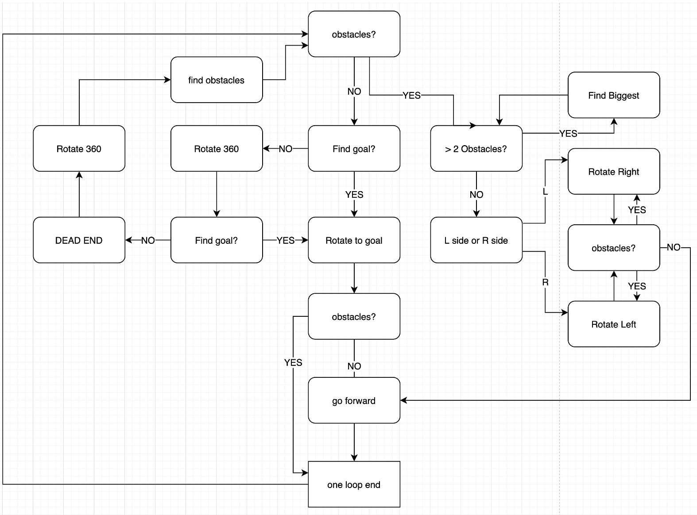

# IBSV-obstacle-avoidence

An IBVS obstacle Avoidance challenge implementation of [SIMUROSOT-ROBOCHALLENGE](https://github.com/zerowind168/SIMUROSOT-ROBOCHALLENGE)

## Implementation 

## Run

Same as the command in [SIMUROSOT-ROBOCHALLENGE](https://github.com/zerowind168/SIMUROSOT-ROBOCHALLENGE), except change the run file from how_to_run.py to A2.py.

## Demo

